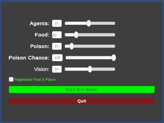
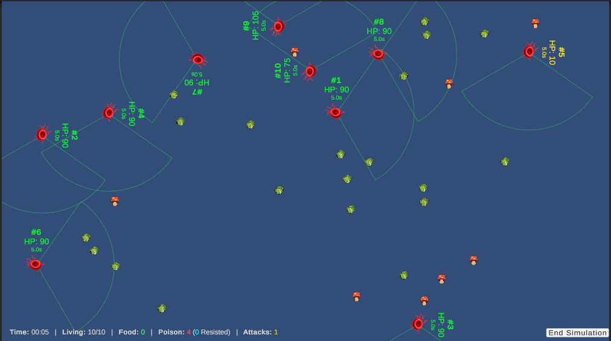
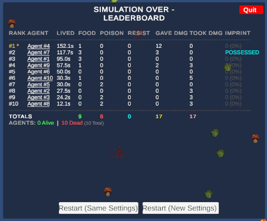
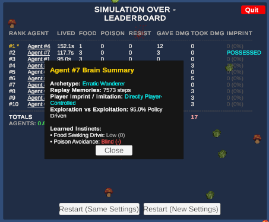
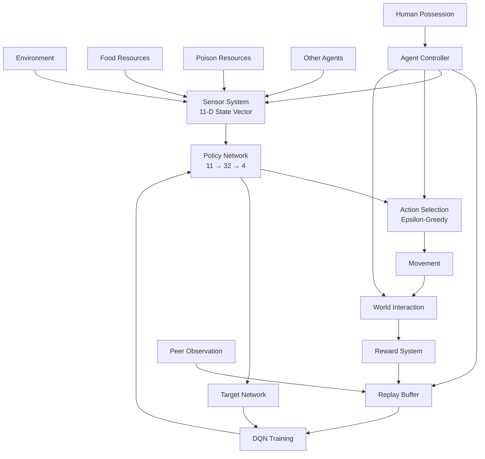
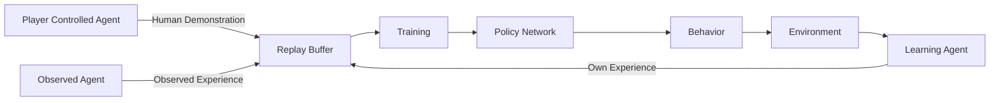
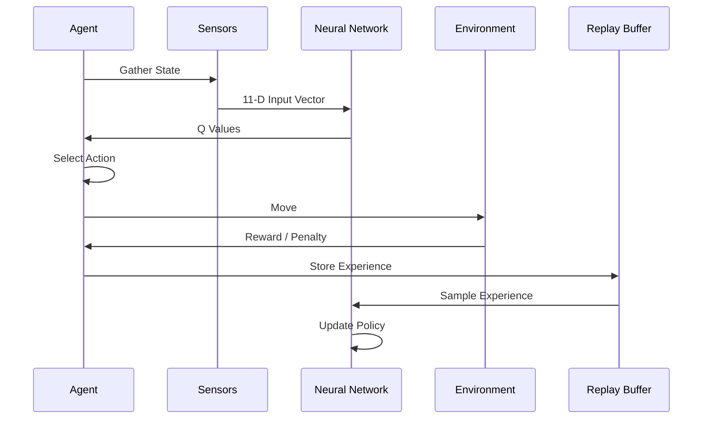

# LifeForm

An artificial life simulation built with Unity that explores reinforcement learning, social learning, predation, survival, and human-guided behavioral training.

    

## Overview

LifeForm is a multi-agent ecosystem where autonomous organisms learn to survive by:

- Finding food
- Avoiding poison
- Escaping stronger organisms
- Hunting weaker organisms
- Learning from direct experience
- Learning from observing peers
- Learning from human-controlled demonstrations

Unlike traditional reinforcement-learning demonstrations, LifeForm combines:

- Reinforcement Learning
- Experience Replay
- Social Learning
- Human Demonstration Learning
- Emergent Predator/Prey Behavior

This creates an environment where successful behaviors can spread across the population without being explicitly programmed.

---

## Quick Start

```bash
git clone https://github.com/bryanspms/LifeForm.git
cd LifeForm
```

1. Open the project in Unity Hub.
2. Load `Assets/LifeFormScene.unity`.
3. Press **Play**.
4. Observe the ecosystem evolve.

---

# System Architecture



---

# Learning Architecture

One of the most unique aspects of LifeForm is the combination of reinforcement learning and social learning.



This allows behavior to spread through a population without being hardcoded.

---

# Agent Decision Cycle



---

# Core Learning System

Each organism continuously performs the following loop:

```text
Observe Environment
        ↓
Build State Vector
        ↓
Neural Network Evaluation
        ↓
Choose Action
        ↓
Move and Interact
        ↓
Receive Reward
        ↓
Store Experience
        ↓
Train Network
```

Over time, agents develop increasingly effective survival behaviors.

---

# Neural Network

Each agent contains two neural networks:

- Policy Network
- Target Network

Architecture:

```text
Input Layer      11
      ↓
Hidden Layer     32 (ReLU)
      ↓
Output Layer      4 (Q-values)
```

Inputs include:

- Agent position
- Direction to nearest food
- Direction to nearest poison
- Direction to strongest nearby threat
- Direction to weakest nearby prey
- Current health ratio

Outputs:

```text
0 = Move Up
1 = Move Down
2 = Move Left
3 = Move Right
```

Action selection uses epsilon-greedy exploration.

---

# Replay Memory

Agents maintain an experience replay buffer.

Each experience contains:

```text
State
Action
Reward
Next State
Done Flag
Observation Flag
```

Experiences originate from:

1. Personal experience
2. Observed peer behavior
3. Human demonstrations

The replay buffer uses a circular overwrite strategy to maintain a fixed memory footprint.

---

# Social Learning

LifeForm supports observational learning.

When a nearby organism successfully performs an action, neighboring agents can record:

```text
Observed State
Observed Action
Discounted Reward
Observed Result
```

This allows useful strategies to spread throughout the ecosystem.

---

# Human Demonstration Learning

Players can directly possess an organism and control its movement.

While possessed:

- AI control is suspended
- Player behavior is recorded
- Nearby organisms observe player actions
- Demonstrated strategies become learning examples

Players effectively act as teachers within the ecosystem.

---

# Survival Mechanics

## Energy

Energy is the primary survival resource.

Agents continuously lose energy over time.

```text
Movement Cost
+
Existence Cost
=
Energy Drain
```

If energy reaches zero:

```text
Agent Dies
```

---

## Food

Benefits:

```text
+30 Energy
+10 Reward
```

Food respawns after being consumed.

---

## Poison

Risks:

```text
-40 Energy
-15 Reward
```

Agents may occasionally resist poison effects.

Successful resistance is tracked independently.

---

# Predation System

Agents compare their energy levels against nearby organisms.

When a stronger organism encounters a weaker one:

```text
Energy Siphon
```

occurs.

Benefits include:

- Energy gain
- Positive reinforcement reward
- Increased survival probability

Consequences for victims include:

- Energy loss
- Negative reinforcement
- Potential death

This naturally creates predator/prey relationships.

---

# Behavioral Profiling

When an agent dies, its behavior can be classified based on lifetime performance.

Possible archetypes include:

```text
Forager
Apex Hunter
Survivalist
Explorer
Erratic Wanderer
```

These profiles are derived from:

- Food consumption
- Poison avoidance
- Combat activity
- Exploration tendencies
- Learned neural-network preferences

---

# Emergent Behaviors

LifeForm is designed to encourage the emergence of:

- Efficient foraging
- Poison avoidance
- Predator/prey strategies
- Risk assessment
- Social learning
- Human-influenced adaptation
- Resource competition
- Opportunistic hunting

No specific survival strategy is explicitly programmed.

---

# Installation

## Prerequisites

### Unity

Install:

- Unity Hub
- Compatible Unity Editor version

The required Unity version can be found in:

```text
ProjectSettings/ProjectVersion.txt
```

Download Unity Hub:

https://unity.com/download

---

## Clone Repository

```bash
git clone https://github.com/bryanspms/LifeForm.git
cd LifeForm
```

Alternatively download the repository ZIP directly from GitHub.

---

## Open Project

1. Launch Unity Hub.
2. Click **Add Project**.
3. Select the cloned `LifeForm` folder.
4. Allow Unity to import assets and rebuild cache files.

The first launch may take several minutes.

---

## Generated Folders

The repository intentionally excludes:

```text
Library/
Temp/
Logs/
Obj/
Build/
Builds/
```

These are automatically regenerated by Unity.

---

## Running the Simulation

Open:

```text
Assets/LifeFormScene.unity
```

Press:

```text
Play
```

Expected behavior:

- Agents spawn
- Resources populate
- Learning begins
- Evolutionary interactions emerge

---

## Controls

### Keyboard

```text
W A S D
```

or

```text
Arrow Keys
```

### Gamepad

```text
Left Stick
D-Pad
```

### Possessed Agent

When an organism is possessed:

- Manual control overrides AI
- Training data is generated from player actions
- Other organisms can learn from demonstrations

---

## Building

Open:

```text
File → Build Profiles
```

Select:

```text
Windows
```

or

```text
Linux
```

Then click:

```text
Build
```

---

## Troubleshooting

### Long Initial Load Times

On first load Unity must:

- Import assets
- Compile scripts
- Rebuild cache files

This can take several minutes.

### Missing Packages

Open:

```text
Window → Package Manager
```

and allow Unity to restore any missing dependencies.

### Build Errors

Try:

```text
Assets → Reimport All
```

If issues persist:

```bash
rm -rf Library
```

and reopen the project.

Unity will regenerate the folder automatically.

---

# Project Structure

```text
Assets/
├── AgentController.cs
├── NeuralNetwork.cs
├── ReplayBuffer.cs
├── FloatingText.cs
├── NumberStepper.cs
├── AgentPrefab.prefab
├── FoodPrefab.prefab
├── PoisonPrefab.prefab
├── LifeFormScene.unity
└── Resources/

Packages/
ProjectSettings/
```

---

# Future Development

Potential future areas of exploration include:

- Genetic evolution
- Reproduction
- Multi-generational inheritance
- Improved sensory systems
- Resource specialization
- Group behavior
- Flocking and schooling
- Pack hunting
- Advanced reinforcement learning algorithms
- Persistent ecosystems
- Long-term analytics and reporting

---

# Why LifeForm Is Different

Most AI simulations focus solely on reinforcement learning.

LifeForm combines:

```text
Reinforcement Learning
        +
Experience Replay
        +
Peer Observation
        +
Human Demonstration
        +
Predator / Prey Dynamics
        =
Emergent Intelligence
```

The result is an ecosystem where learning can spread through observation, teaching, and adaptation rather than hardcoded behavior.

---

# License

LifeForm is licensed under the MIT License.

You are free to:

- Use the source code
- Modify the source code
- Distribute copies
- Incorporate portions of the project into your own work
- Use the software for commercial or non-commercial purposes

Provided that:

- Proper attribution is maintained
- The original copyright notice is preserved
- A copy of the MIT License is included with distributions

See the LICENSE file for full details.

Copyright (c) 2026 Bryan Price

---

## Attribution

If you build upon LifeForm, attribution is appreciated.

Suggested attribution:

"Based on LifeForm (github.com/bryanspms/LifeForm) by Bryan Price"
