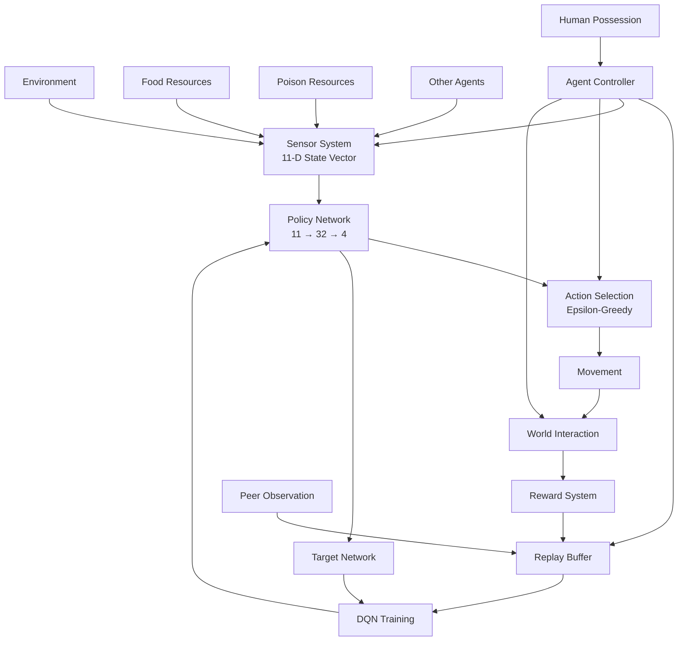
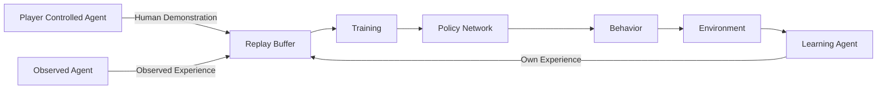
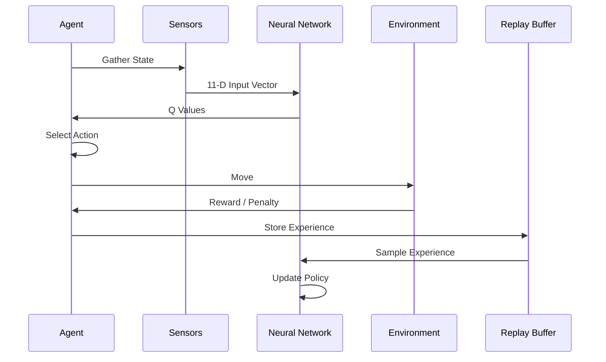

##LifeForm

**LifeForm** is an interactive 2D artificial life and reinforcement learning simulation developed in Unity (C#). Organisms inhabit an enclosed ecosystem where they search for food, avoid lethal hazards, compete for energy through predatory siphoning, and continuously adapt their behaviors through real-time training and imitation.

The project features a **Life Replayer** system that allows users to step frame-by-frame through any organism's full lifespan to examine its neural decisions, directional sensors, peer encounters, and feeding locations.

---

## Visual Overview

| Arena Simulation | Setup Menu |
| ---------------- | ---------- |
|  |  |

| Post-Simulation Leaderboard | Brain & Archetype Inspection |
| --------------------------- | ---------------------------- |
|  |  |

| Life Replayer |
| ------------- |
|               |


---

# LifeForm

**LifeForm** is an interactive 2D artificial life and reinforcement learning simulation developed in Unity (C#).  It is designed to explore reinforcement learning, social learning, predation, survival, and human-guided behavioral training. 

Organisms inhabit an enclosed ecosystem where they search for food, avoid lethal hazards, compete for energy through predatory siphoning, and continuously adapt their behaviors through real-time training and imitation.

The project features a **Life Replayer** system that allows users to step frame-by-frame through any organism's full lifespan to examine its neural decisions, directional sensors, peer encounters, and feeding locations.

---

# Why LifeForm Is Different

Most AI simulations focus solely on reinforcement learning.

LifeForm combines:

```text
Reinforcement Learning
        +
Experience Replay
        +
Peer Observation
        +
Human-Controlled Demonstration
        +
Predator / Prey Dynamics
        =
Emergent Intelligence
```

The result is an ecosystem where learning can spread through observation, teaching, and adaptation rather than hardcoded behavior.

---

## Core Systems

### 1. Neural Architecture & Reinforcement Learning

- **Deep Q-Network (DQN)**: Each organism processes an 11-input observation vector through an onboard neural network to select discrete directional maneuvers (Up, Down, Left, Right).
- **Imitation & Peer Observation**: Organisms monitor other agents within their field of view and push discounted peer experiences to their circular replay memory.
- **Distance-Based Reward Shaping**: Subtle directional scent trails reward moving toward food and penalize steering closer to poison, helping bootstrap navigation before chance collisions occur.
- **Desperation Scaling**: Lower health levels dynamically shorten decision cooldown intervals and increase turning responsiveness, producing rapid evasion maneuvers when starving.

### 2. Predation & Combat Mechanics

- **Predatory Siphoning**: When two organisms collide, the individual with higher energy drains up to 15 points of energy from the weaker prey, accompanied by combat impact audio and floating green/red damage indicators.
- **Knockback & Evasion**: Damaged prey organisms execute an instant burst of escape velocity directly away from the predator.
- **Selective Foraging**: Poison consumption evaluates against a configurable damage chance, enabling organisms with cautious policies to resist lethal penalties.

### 3. Interactive Player Possession

- **Direct Control**: Click any live agent or cycle via gamepad/keyboard to manually pilot an organism across the arena.
- **Behavioral Imprinting**: Nearby autonomous organisms observe player-driven actions, directly imprinting user behaviors into their neural replay buffers and altering their evolutionary profiles.
- **Cursor Inspection**: Hovering over any organism halts its linear momentum to allow close inspection of its dynamic HUD without stopping the global simulation.

### 4. Post-Mortem Analytics & Life Replayer

- **Automated Leaderboard**: Summarizes survival times, food ingested, poison resisted, damage inflicted/sustained, and player memory influence percentages upon extinction or manual stop.
- **Cognitive Archetype Classifier**: Evaluates directional policy probes to diagnose survival styles, including *Apex Predator*, *Forager*, *Cautious Survivor*, *Indecisive Wanderer*, and *Erratic Explorer*.
- **Frame-by-Frame Timeline**: Scrub backwards and forwards through an agent's recorded history with synchronized audio and step-by-step telemetry.
- **Dynamic Dashed Vision Cone**: Displays the agent's exact visual field-of-view angle and scan depth during playback.
- **Combat Peer Holograms**: Spawns translucent holograms of other organisms at the exact coordinates where attacks or evasions took place.
- **Consumption Event Markers**: Places persistent translucent ghost markers across the arena floor highlighting where food and poison items were consumed.
- **Sensory HUD Legend**: An in-engine, translucent HUD overlay identifying each active sensory ray.

---

## Sensory Vector Legend

During life replay, sensory vectors render from the agent's center to indicate its input layer state:

| Ray / Indicator | Color | Representation |
| --- | --- | --- |
| **Nearest Food** | **Green** (`#33FF33`) | Vector directed toward the closest detected food item. |
| **Nearest Hazard** | **Red** (`#FF3333`) | Vector pointing toward the closest detected poison hazard. |
| **Prey Target** | **Amber / Gold** (`#FFC000`) | Vector tracking the nearest weaker organism eligible for siphoning. |
| **Threat (Predator)** | **Magenta / Purple** (`#E600E6`) | Vector tracking the nearest stronger organism posing an attack hazard. |
| **Vision Cone Arc** | **Translucent Dashed Green** | Outlines the active field of view angle and peripheral detection limit. |

---

## Quick Start for Unity (download project)

```bash
git clone https://github.com/bryanspms/LifeForm.git
cd LifeForm
```

1. Open the project in Unity Hub.
2. Load `Assets/LifeFormScene.unity`.
3. Press **Play**.
4. Observe the ecosystem evolve.

---

## Quick Start for **SteamDeck** (download files)

To recombine and unpack your split archive (due to GitHub's 25GB limit), you only need to run the extraction command on the first part (.001). 7-Zip will automatically locate, merge, and unpack all subsequent parts in the sequence as long as they reside in the same folder.

1.Download the following files:
    -    LifeForm-Release.7z.001
    -    LifeForm-Release.7z.002
2. Open Terminal and navigate to the foler containing the 2 7zip files.
3. Enter the commands:

```bash
7z x LifeForm-Release.001 -o"/home/deck/games/simulation/LifeForm"
cd /home/deck/games/simulation/LifeForm
chmod +x LifeForm.x86_64
./LifeForm.x86_64
```

   **NOTE:**  -o"/home/deck/games/simulation/LifeForm" is the output folder for the ziped file parts.  Modify the path where ever you choose to install it.
4. Observe the ecosystem evolve.

---

# System Architecture


```mermaid
flowchart TD

    ENV[Environment]
    FOOD[Food Resources]
    POISON[Poison Resources]
    AGENTS[Other Agents]

    ENV --> SENSOR
    FOOD --> SENSOR
    POISON --> SENSOR
    AGENTS --> SENSOR

    SENSOR[Sensor System<br/>11-D State Vector]

    SENSOR --> POLICY

    POLICY[Policy Network<br/>11 → 32 → 4]

    POLICY --> ACTION

    ACTION[Action Selection<br/>Epsilon-Greedy]

    ACTION --> MOVE[Movement]

    MOVE --> WORLD[World Interaction]

    WORLD --> REWARD[Reward System]

    REWARD --> MEMORY

    MEMORY[Replay Buffer]

    MEMORY --> TRAIN

    TRAIN[DQN Training]

    TRAIN --> POLICY

    POLICY --> TARGET[Target Network]

    TARGET --> TRAIN

    PLAYER[Human Possession]

    PLAYER --> AGENTCTRL
    AGENTCTRL --> MEMORY

    PEER[Peer Observation]

    PEER --> MEMORY

    AGENTCTRL[Agent Controller]

    AGENTCTRL --> SENSOR
    AGENTCTRL --> ACTION
    AGENTCTRL --> WORLD
```

---

# Learning Architecture

One of the most unique aspects of LifeForm is the combination of reinforcement learning and social learning.


```mermaid
flowchart LR

    Player[Player Controlled Agent]
    Peer[Observed Agent]
    Agent[Learning Agent]

    Player -->|Human Demonstration| Buffer

    Peer -->|Observed Experience| Buffer

    Agent -->|Own Experience| Buffer

    Buffer[Replay Buffer]

    Buffer --> Train[Training]

    Train --> Policy[Policy Network]

    Policy --> Behavior[Behavior]

    Behavior --> Environment

    Environment --> Agent
```

This allows behavior to spread through a population without being hardcoded.

---

# Agent Decision Cycle


```mermaid
sequenceDiagram

    participant A as Agent
    participant S as Sensors
    participant N as Neural Network
    participant E as Environment
    participant M as Replay Buffer

    A->>S: Gather State
    S->>N: 11-D Input Vector
    N->>A: Q Values

    A->>A: Select Action

    A->>E: Move

    E->>A: Reward / Penalty

    A->>M: Store Experience

    M->>N: Sample Experience

    N->>N: Update Policy
```

---

# Core Learning System

Each organism continuously performs the following loop:

```text
Observe Environment
        ↓
Build State Vector
        ↓
Neural Network Evaluation
        ↓
Choose Action
        ↓
Move and Interact
        ↓
Receive Reward
        ↓
Store Experience
        ↓
Train Network
```

Over time, agents develop increasingly effective survival behaviors.

---

# Neural Network

Each agent contains two neural networks:

- Policy Network
- Target Network

Architecture:

```text
Input Layer      11
      ↓
Hidden Layer     32 (ReLU)
      ↓
Output Layer      4 (Q-values)
```

Inputs include:

- Agent position
- Direction to nearest food
- Direction to nearest poison
- Direction to strongest nearby threat
- Direction to weakest nearby prey
- Current health ratio

Outputs:

```text
0 = Move Up
1 = Move Down
2 = Move Left
3 = Move Right
```

Action selection uses epsilon-greedy exploration.

---

# Replay Memory

Agents maintain an experience replay buffer.

Each experience contains:

```text
State
Action
Reward
Next State
Done Flag
Observation Flag
```

Experiences originate from:

1. Personal experience
2. Observed peer behavior
3. Human demonstrations

The replay buffer uses a circular overwrite strategy to maintain a fixed memory footprint.

---

# Social Learning

LifeForm supports observational learning.

When a nearby organism successfully performs an action, neighboring agents can record:

```text
Observed State
Observed Action
Discounted Reward
Observed Result
```

This allows useful strategies to spread throughout the ecosystem.

---

# Human Demonstration Learning

Players can directly possess an organism and control its movement.

While possessed:

- AI control is suspended
- Player behavior is recorded
- Nearby organisms observe player actions
- Demonstrated strategies become learning examples

Players effectively act as teachers within the ecosystem.

---

# Survival Mechanics

## Energy

Energy is the primary survival resource.

Agents continuously lose energy over time.

```text
Movement Cost
+
Existence Cost
=
Energy Drain
```

If energy reaches zero:

```text
Agent Dies
```

---

## Food

Benefits:

```text
+30 Energy
+10 Reward
```

Food respawns after being consumed.

---

## Poison

Risks:

```text
-40 Energy
-15 Reward
```

Agents may occasionally resist poison effects.

Successful resistance is tracked independently.

---

# Predation System

Agents compare their energy levels against nearby organisms.

When a stronger organism encounters a weaker one:

```text
Energy Siphon
```

occurs.

Benefits include:

- Energy gain
- Positive reinforcement reward
- Increased survival probability

Consequences for victims include:

- Energy loss
- Negative reinforcement
- Potential death

This naturally creates predator/prey relationships.

---

# Behavioral Profiling

When an agent dies, its behavior can be classified based on lifetime performance.

Possible archetypes include:

```text
Forager
Apex Hunter
Survivalist
Explorer
Erratic Wanderer
```

These profiles are derived from:

- Food consumption
- Poison avoidance
- Combat activity
- Exploration tendencies
- Learned neural-network preferences

---

# Emergent Behaviors

LifeForm is designed to encourage the emergence of:

- Efficient foraging
- Poison avoidance
- Predator/prey strategies
- Risk assessment
- Social learning
- Human-influenced adaptation
- Resource competition
- Opportunistic hunting

No specific survival strategy is explicitly programmed.

---

### Possessed Agent

When an organism is possessed:

- Manual control overrides AI
- Training data is generated from player actions
- Other organisms can learn from demonstrations

---

# Installation

## Prerequisites

### Unity

Install:

- Unity Hub
- Compatible Unity Editor version

The required Unity version can be found in:

```text
ProjectSettings/ProjectVersion.txt
```

Download Unity Hub:

https://unity.com/download

---

## Clone Repository

```bash
git clone https://github.com/bryanspms/LifeForm.git
cd LifeForm
```

Alternatively download the repository ZIP directly from GitHub.

---

## Open Project

1. Launch Unity Hub.
2. Click **Add Project**.
3. Select the cloned `LifeForm` folder.
4. Allow Unity to import assets and rebuild cache files.

The first launch may take several minutes.

---

## Generated Folders

The repository intentionally excludes:

```text
Library/
Temp/
Logs/
Obj/
Build/
Builds/
```

These are automatically regenerated by Unity.

---

## Running the Simulation

Open:

```text
Assets/LifeFormScene.unity
```

Press:

```text
Play
```

Expected behavior:

- Agents spawn
- Resources populate
- Learning begins
- Evolutionary interactions emerge

---

## Controls

### Keyboard

```text
W A S D
```

or

```text
Arrow Keys
```

### Gamepad

```text
Left Stick
D-Pad
```

---

## Building

Open:

```text
File → Build Profiles
```

Select:

```text
Windows
```

or

```text
Linux
```

Then click:

```text
Build
```

---

## Troubleshooting

### Long Initial Load Times

On first load Unity must:

- Import assets
- Compile scripts
- Rebuild cache files

This can take several minutes.

### Missing Packages

Open:

```text
Window → Package Manager
```

and allow Unity to restore any missing dependencies.

### Build Errors

Try:

```text
Assets → Reimport All
```

If issues persist:

```bash
rm -rf Library
```

and reopen the project.

Unity will regenerate the folder automatically.

---

# Project Structure

```text
Assets/
├── AgentController.cs
├── NeuralNetwork.cs
├── ReplayBuffer.cs
├── FloatingText.cs
├── NumberStepper.cs
├── AgentPrefab.prefab
├── FoodPrefab.prefab
├── PoisonPrefab.prefab
├── LifeFormScene.unity
└── Resources/

Packages/
ProjectSettings/
```

---

# Future Development

Potential future areas of exploration include:

- Genetic evolution
- Reproduction
- Multi-generational inheritance
- Improved sensory systems
- Resource specialization
- Group behavior
- Flocking and schooling
- Pack hunting
- Advanced reinforcement learning algorithms
- Persistent ecosystems
- Long-term analytics and reporting

---

# License

LifeForm is licensed under the MIT License.

You are free to:

- Use the source code
- Modify the source code
- Distribute copies
- Incorporate portions of the project into your own work
- Use the software for commercial or non-commercial purposes

Provided that:

- Proper attribution is maintained
- The original copyright notice is preserved
- A copy of the MIT License is included with distributions

See the LICENSE file for full details.

Copyright (c) 2026 Bryan Price

---

## Attribution

If you build upon LifeForm, attribution is appreciated.

Suggested attribution:

"Based on LifeForm (github.com/bryanspms/LifeForm) by Bryan Price"
